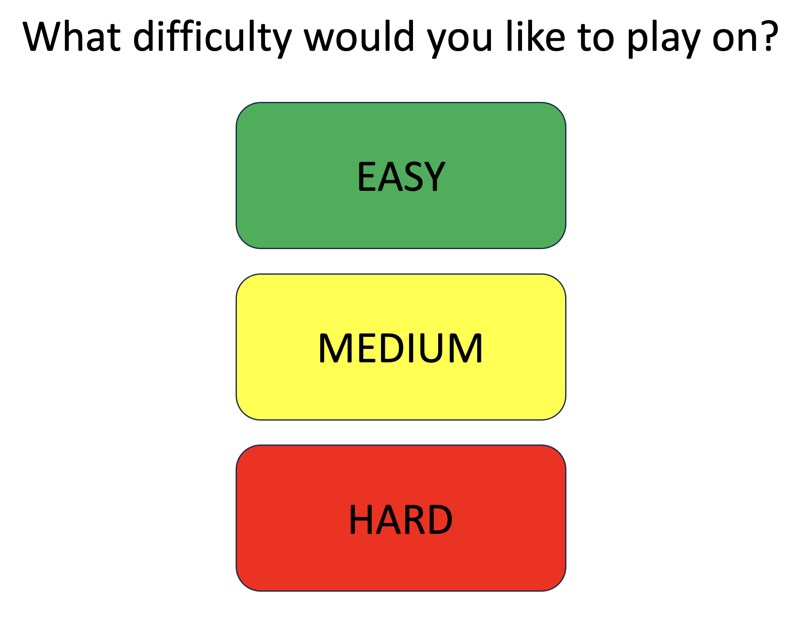

# Sudoku Design Specification

1. GUI
2. GUI
3. The tiles that are chosen to be revealed at the start will be randomized as well as the actual numbers that will be in those tiles at the start of each game. A fully complete board will be constructed behind the scenes to ensure that each starting board is valid. The only component of the starting board that won't be random is every row, column, and square will have at least one entry.
4. At start of each game the user wil have the opportunity to choose between easy, medium, and hard using GUI for each option. Once the game is done generating the board for specified game mode it will iterate through each column, row, and square to verify that each component has at least one entry.

    **<ins>Mock up of the difficulty selection GUI:<ins>**

    

    1. Easy:
        1. Counter increments after each square is revealed, revelation process stops once counter hits 33.
    2. Medium:
        1. Counter increments after each square is revealed, revelation process stops once counter hits 25.
    3. Hard:
        1. Counter increments after each square is revealed, revelation process stops once counter hits 17.
5. The game logic will be able to verify if the proposed solution to the sudoko puzzle is valid after the submit button is clicked. If invalid the the incorrect boxes will be highlighted. The game will then provide two options to the user, allowing them to continue with incorrect boxes cleared or end the game. If the proposed solution is correct, a GUI will display their game summary(score). 
Scoring logic: 
6. Backend
7. GUI
8. Backend
