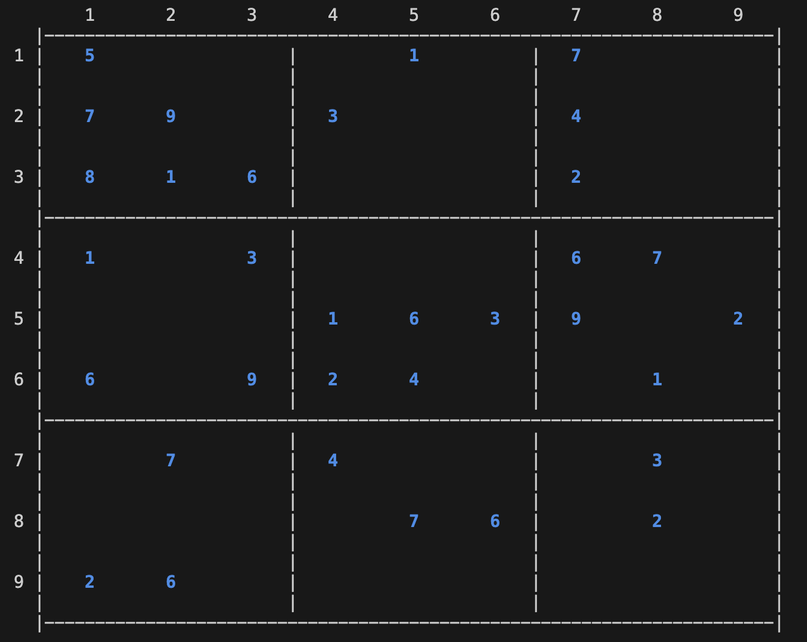
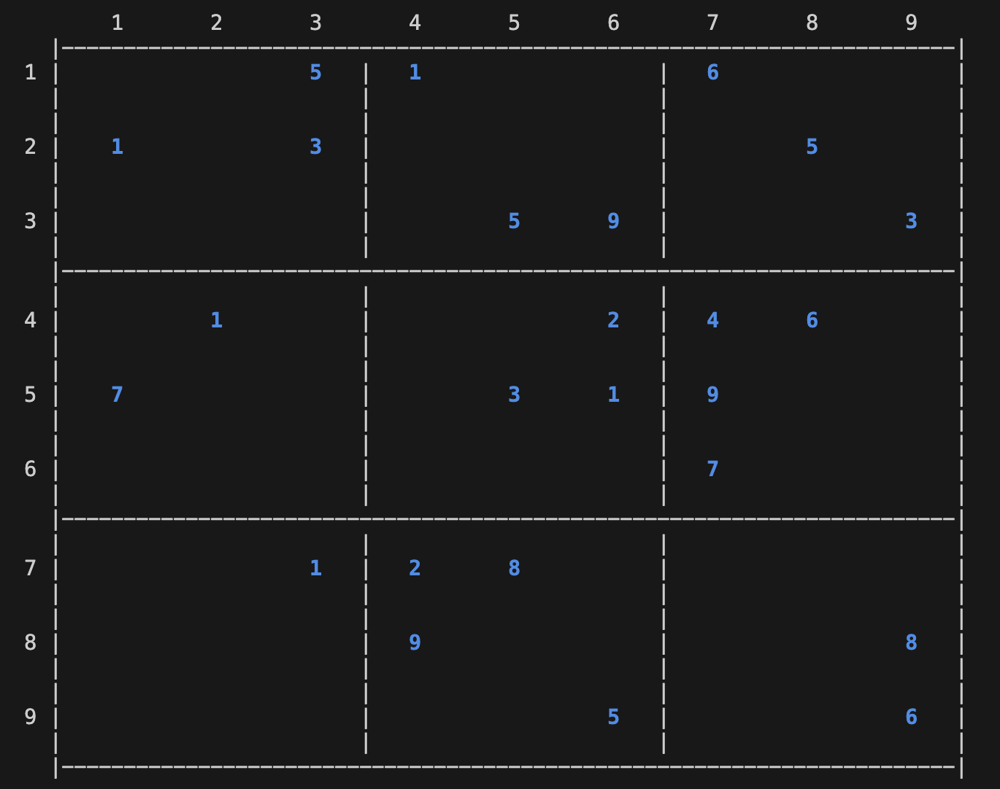
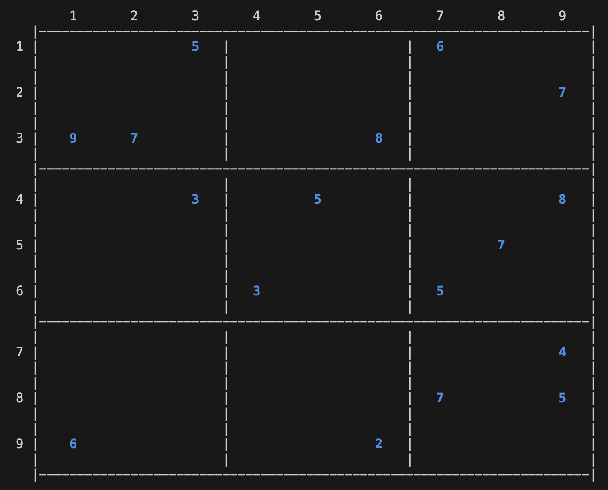
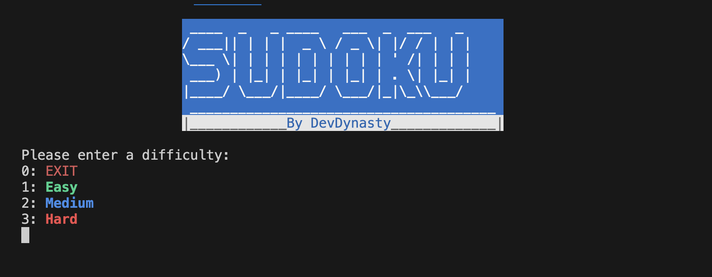
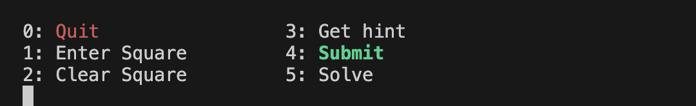

# Sudoku Minimum Viable Product (MVP)

1. Shall randomize starting board at beginning of game.

2. Shall have easy, medium, and hard difficulty settings.
    1. Easy:
        1. 33 tiles of the board will be complete.
        
    2. Medium:
        1. 25 tiles of the board will be complete.
        
    3. Hard:
        1. 17 tiles of the board will be complete.
        
3. Game shall be played in the terminal.
    1. Shall incorporate various color schemes to the game.
    2. Shall instruct user how to interact with the game at each step.
    3. Shall display sudoku header throughout entirety of game.
    
4. Shall be various modes of interaction for the user while playing
    1. Shall allow the user to quit at any given time.
    2. Shall allow the user to make an entry to the board.
    3. Shall allow the user to erase their entry.
    4. Shall offer hints that tell the user the row, column, and value.
    5. Shall allow user to submit their board when they are finished.
    6. Shall allow user to solve entire board at once.
    
        